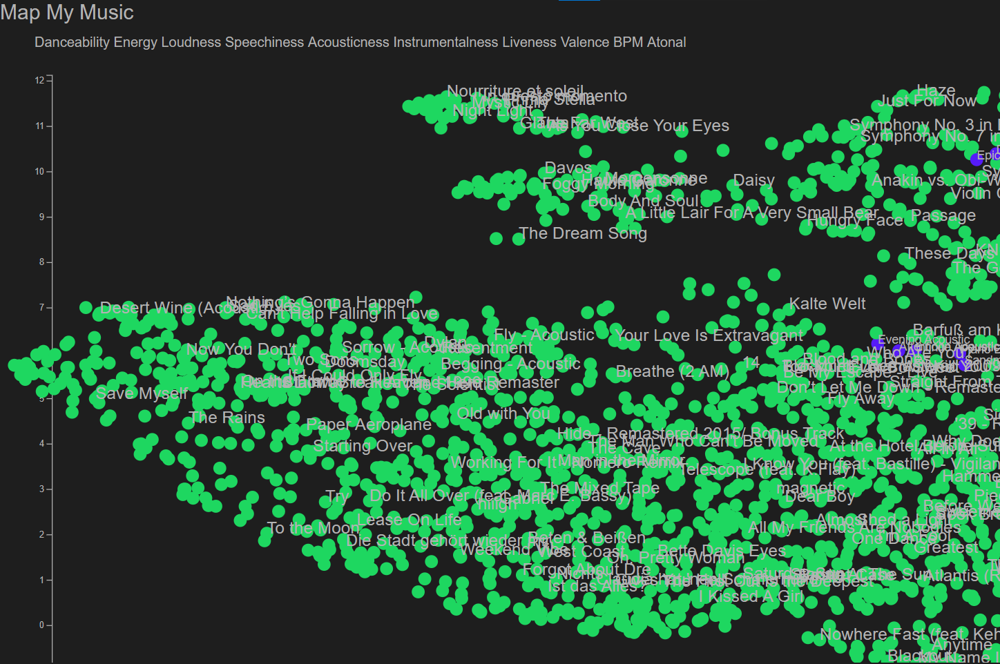
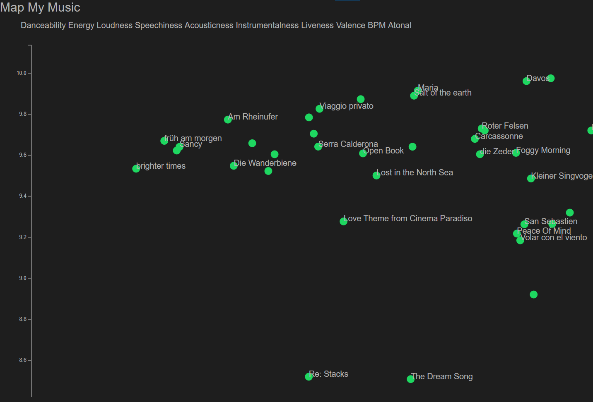

# Map My Music

Creates a UMAP embedding of your Spotify songs and visualizes them in an interactive web app.
### Start Web-Server
````
cd backend
$env:FLASK_APP="app.py"
flask run
````

### Techstack

- **front-end**: d3.js
- **back-end**: flask 
- **music data**: Spotify Python API & Spotify Web API
- **embedding**: UMAP


### Usage

1. Login into Spotify
2. let UMAP of your music by generated
3. explore your music map (zoom and pane)
4. click on any song to playback in spotify




